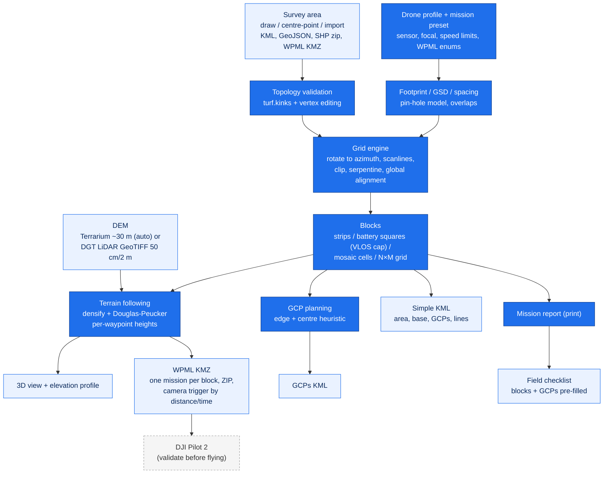

# dji-mission-planner

> Browser-based drone mapping mission planner that draws survey areas, computes photogrammetric/LiDAR flight grids with terrain following, splits them into battery-sized blocks, and exports KML and DJI WPML (KMZ) for DJI Pilot 2.

[](https://react.dev)
[](https://vitejs.dev)
[](https://leafletjs.com)
[](https://turfjs.org)
[](https://threejs.org)
[](https://enterprise.dji.com)
[](https://developer.dji.com/doc/cloud-api-tutorial/en/api-reference/dji-wpml/overview.html)
[](#usage)
[](#data-sources)
[](LICENSE)
[](https://github.com/PedroMMGoncalves/dji-mission-planner/actions/workflows/deploy.yml)
[](https://pedrommgoncalves.github.io/dji-mission-planner/)
[](https://github.com/PedroMMGoncalves/dji-mission-planner/commits/main)

A single-page web application, 100% client-side (no backend, no API keys), that plans drone mapping missions end to end: hardware profiles, area definition, flight-grid computation, terrain following from a DEM, block splitting sized by battery, GCP placement, a printable mission report and a field checklist. Missions export as standard KML or as the official DJI WPML structure (`wpmz/template.kml` + `waylines.wpml`) ready to import in **DJI Pilot 2**.

This tool is the **mission planning engine only**. Airspace authorisation, UAS-zone licensing and flight execution are done upstream/downstream and are NOT part of this app. Always validate the imported mission in DJI Pilot 2 before flying.

**Live app:** <https://pedrommgoncalves.github.io/dji-mission-planner/>

## Contents

[Quick start](#quick-start) - [Summary](#summary) - [Method](#method) - [Requirements](#requirements) - [Data sources](#data-sources) - [Usage](#usage) - [Exports](#exports) - [DJI Pilot 2 notes](#dji-pilot-2-notes) - [Development](#development) - [Deployment](#deployment) - [Limitations and notes](#limitations-and-notes) - [License](#license)

---

## Quick start

1. **Open the app** at the live URL (or `npm install && npm run dev` locally).
2. **Pick the drone/sensor** (Mavic 3E, Matrice 4T, M300 RTK + P1, or a custom camera/LiDAR) and a **mission preset** (2D ortho quality/fast, 3D crosshatch, multispectral, LiDAR) — or set altitude/GSD, speed and overlaps by hand.
3. **Define the area**: draw a polygon, generate a centre-point rectangle/square (with an optional N×M block grid), or import a KML / GeoJSON / zipped Shapefile / WPML KMZ.
4. **Split into blocks** if the area exceeds one battery: strips by area, battery-sized squares (VLOS-capped), or a manual square mosaic with clickable cells.
5. **Terrain**: the global DEM loads automatically for the area; enable *Follow terrain* for per-waypoint heights, or import a DGT LiDAR DTM GeoTIFF (50 cm / 2 m) for high-resolution following. Check the result in the **3D view** and the **elevation profile**.
6. **Plan GCPs** (edge + centre heuristic) and export them as KML for the RTK rover.
7. **Export**: *Simple KML* (area + base + GCPs + flight lines) or *Advanced WPML (KMZ)* — one KMZ per block, zipped, with automatic camera triggering. Print the **mission report** and take the **field checklist**.

---

## Summary

- **Hardware dictionary** (`src/data/drones.js`): fleet profiles with sensor geometry, image size, WPML enums, speed limits and minimum shutter interval; extensible, plus a custom camera/LiDAR profile.
- **Mission presets**: survey-type catalogue (2D ortho quality/fast, 3D crosshatch at −60°, multispectral, LiDAR standard/dense) applying overlaps, speed, gimbal and double grid in one click.
- **Flight grid engine** (`src/utils/geo.js`, Turf.js): ground footprint and GSD from the pin-hole model, line spacing from side overlap (or manual spacing), serpentine lines clipped strictly inside the (optionally buffered) area, any azimuth, concave polygons supported, globally aligned lines across blocks.
- **Blocks**: strips by max area; battery-sized squares solved from a flight-time model (duration × return reserve − transit to home, VLOS side cap); manual square mosaic over any polygon with clickable cells and Ctrl+Z undo; centre-point N×M grids.
- **Terrain following** (`src/utils/terrain.js`): Terrarium global tiles (~30 m) decoded in-browser with despiking, or a local DGT LiDAR GeoTIFF read lazily by window (multi-GB files safe, `src/utils/demFile.js`); flight lines densified and simplified by vertical tolerance (Douglas-Peucker) into per-waypoint execute heights.
- **3D view** (`src/components/Map3D.jsx`, three.js, lazy-loaded): terrain mesh with satellite texture and the flight lines at their true heights; vertical exaggeration; plus a distance×height **elevation profile** chart with minimum-clearance highlighting.
- **GCP planning** (`src/utils/gcp.js`): edge + centre heuristic with greedy farthest-point selection (~1 GCP / 5 ha, min 5), numbered targets on the map, own KML export, pre-fill into the checklist.
- **Field checklist**: 75-item pre/in/post-field checklist with flight and GCP logs, autosaved locally, JSON export, printable (filled or blank).
- **Mission report**: printable A4 report with a canvas map (imagery, area, blocks, base, GCPs), parameter and block tables, and signature lines.
- **Projects**: autosave in the browser plus save/open as a JSON file. **Bilingual UI** (PT/EN).

---

## Method



Line spacing comes from the across-track ground footprint, `altitude × sensor_width / focal_length`, times `(1 − side_overlap)`; the photo interval uses the along-track footprint and front overlap (LiDAR swath uses `2 × altitude × tan(FOV/2)`). The grid is computed in a rotated frame (area rotated by `90° − azimuth` about a shared pivot) so that scanlines are horizontal; with blocks, all cells share one alignment origin, making lines collinear across block boundaries.

---

## Requirements

- Any modern browser (Chromium, Firefox, Safari). No account, no API keys.
- For development: Node.js ≥ 18 and npm.
- Internet access for base maps, CAOP overlays and the global DEM (a local GeoTIFF DTM works as the elevation source once imported).

## Data sources

- **Base maps:** Esri World Imagery / labels / topographic, OpenStreetMap.
- **Administrative boundaries:** CAOP © Direção-Geral do Território (CC-BY 4.0) — municipalities bundled as simplified vectors with scale-dependent labels, parishes via the DGT WMS.
- **Global elevation:** Terrarium terrain tiles (Mapzen / AWS Open Data, ~30 m).
- **High-resolution elevation:** [LiDAR survey of mainland Portugal](https://www.dgterritorio.gov.pt/levantamento-lidar-de-portugal-continental-0) © DGT (CC-BY 4.0) — download the DTM GeoTIFF (50 cm or 2 m) for your area from the [CDD portal](https://cdd.dgterritorio.gov.pt/) and import it; only the window covering the survey area is read, so multi-GB municipal files open in seconds.

## Usage

The left panel drives everything top-down: mission name and project save/open; drone and preset; flight parameters (altitude ↔ target GSD, speed clamped to the drone's limits, overlaps or manual spacing, trigger mode, gimbal pitch); line azimuth with parallel/perpendicular/oblique shortcuts and optional crosshatch; outward buffer; area tools (draw, rectangle, square, import, home point); block splitting; terrain; GCPs. The header holds the 3D view, the mission report, the field checklist, the two exports, help and language. Everything recomputes reactively; the metrics panel (bottom right) shows GSD, footprint, spacing, counts, distance and estimated time.

Editing gestures: click to add vertices (Backspace or click a vertex to remove, double-click to close, Esc to cancel); drag vertices, drag edge midpoints to insert, right-click a vertex to delete; click mosaic cells to toggle them; **Ctrl+Z** undoes area and cell edits.

## Exports

| Export | Content | Use |
| --- | --- | --- |
| Simple KML | Area polygon, home point, GCPs, flight lines (foldered) | Drawing the mission in Pilot 2; QGIS |
| Advanced WPML (KMZ) | `wpmz/template.kml` + `waylines.wpml`, per-waypoint heights when terrain following, camera trigger by distance/time, gimbal action | Direct import in DJI Pilot 2; one KMZ per block (ZIP) with blocks active |
| GCPs KML | Numbered GCP points | RTK rover / field |
| Project JSON | Full planner state | Archive, sharing, reopening |
| Checklist JSON / print | Field record | Operations log |
| Mission report (print) | Map, parameters, blocks, GCPs, signatures | Field folder / licensing annex |

## DJI Pilot 2 notes

The WPML enums shipped are `M3E = 77/66`, `M4T = 99/89`, `M300 RTK + P1 = 60/50` (drone/payload). They follow DJI's WPML documentation but firmware versions vary — if Pilot 2 rejects an import, adjust the enums in `src/data/drones.js` (or in the UI for the custom profile) against the [DJI Cloud API WPML reference](https://developer.dji.com/doc/cloud-api-tutorial/en/api-reference/dji-wpml/overview.html). Heights are relative to the take-off point: set the home point at the real take-off location before exporting terrain-following missions.

## Development

```bash
npm install
npm run dev        # local dev server
npm run build      # production build in dist/
node smoke-test.mjs  # geospatial + exporter test suite
```

## Deployment

Pushes to `main` build and publish automatically to GitHub Pages via [.github/workflows/deploy.yml](.github/workflows/deploy.yml) (Settings → Pages → Source: GitHub Actions). The Vite `base` is set to the repository name.

## Limitations and notes

- Terrain-following heights assume the WPML `relativeToStartPoint` height mode; the reference elevation is the home point (or the first waypoint when no home is set).
- Battery block sizing uses a flight-time model (line length, connectors, turn cost, transit) — it is an estimate; validate against your aircraft's real endurance.
- The mosaic/battery cells fly the full square even where it exceeds the polygon (disable unwanted cells by clicking them).
- CAOP municipal vectors are simplified (~1:100k) for display; parish boundaries stream from the official DGT WMS.
- GCP placement is a geometric heuristic (edge + centre, maximum dispersion); it does not model image geometry.
- No offline mode by design: planning is office work.

## License

[GPL-3.0](LICENSE)
