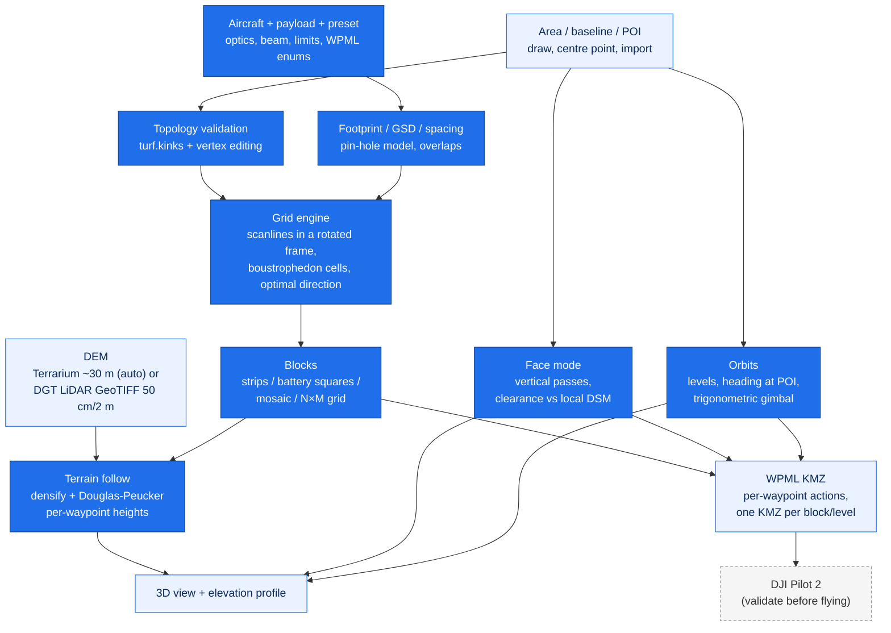

# dji-mission-planner

English | **[Português](README.pt.md)**

> Browser-based drone mapping mission planner: survey areas, photogrammetric/LiDAR flight grids with terrain following, corridors along linear features, facades, orbits and inspection points, battery-sized block splitting, and KML / DJI WPML (KMZ) export for DJI Pilot 2.

[](https://react.dev)
[](https://vitejs.dev)
[](https://leafletjs.com)
[](https://turfjs.org)
[](https://threejs.org)
[](https://enterprise.dji.com)
[](https://developer.dji.com/doc/cloud-api-tutorial/en/api-reference/dji-wpml/overview.html)
[](#usage)
[](#data-sources)
[](LICENSE)
[](https://github.com/PedroMMGoncalves/dji-mission-planner/actions/workflows/deploy.yml)
[](https://pedrommgoncalves.github.io/dji-mission-planner/)
[](https://github.com/PedroMMGoncalves/dji-mission-planner/commits/main)

A single-page web application, 100% client-side (no backend, no API keys), that plans drone mapping missions end to end: aircraft+payload profiles, area definition, concave-safe flight grids, terrain following from a DEM, battery-sized block splitting, face mode, multi-level orbits, inspection points, GCP placement, a printable mission report and a field checklist. Missions export as plain KML or as the official DJI WPML structure (`wpmz/template.kml` + `waylines.wpml`), ready to import in **DJI Pilot 2**.

This tool is the **mission planning engine only**. Airspace authorisation, UAS-zone licensing and flight execution are done upstream/downstream and are NOT part of this app. Always validate the imported mission in DJI Pilot 2 before flying.

**Live app:** <https://pedrommgoncalves.github.io/dji-mission-planner/>

<!-- Screenshots are captured during the release QA pass and restored here.
 -->

## Contents

[Quick start](#quick-start) - [Summary](#summary) - [Method](#method) - [Validation status](#validation-status) - [Requirements](#requirements) - [Data sources](#data-sources) - [Usage](#usage) - [Exports](#exports) - [DJI Pilot 2 notes](#dji-pilot-2-notes) - [Development](#development) - [Deployment](#deployment) - [Limitations and notes](#limitations-and-notes) - [License](#license)

---

## Quick start

1. **Open the app** at the live URL (or `npm install && npm run dev` locally).
2. **Pick the aircraft and payload** (M3E, M4T, M300 RTK with P1, YellowScan Mapper+ or custom) and a **mission preset** — or set altitude/GSD, speed and overlaps by hand.
3. **Pick the mission type** in the selector at the top of the panel: **Area** (nadir/oblique grid), **Corridor** (parallel passes along a centreline), **Face** (vertical serpentine over a wall) or **Orbit** (multi-level circles around a target). Inspection points live as an extra layer of the Area mode.
4. **Area**: draw a polygon, generate a centre-point rectangle/square, or import KML / GeoJSON / zipped Shapefile / WPML KMZ. The **Optimal** direction shortcut finds the orientation with the fewest lines inside the real polygon.
5. **Split into blocks** when the area exceeds one battery: strips by area, battery-sized squares (VLOS-capped) or a manual mosaic with clickable cells.
6. **Terrain**: the global DEM loads automatically; enable *terrain follow* for per-waypoint heights, or import a DGT LiDAR GeoTIFF (50 cm / 2 m). Check the **3D view** and the **elevation profile** — the 3D view also renders face passes and orbit rings.
7. **Export**: simple KML or WPML (KMZ) — one KMZ per block (ZIP) with blocks active, one KMZ per level for orbits. Print the **mission report** and take the **field checklist**.

---

## Summary

- **Aircraft + payload model** (`src/data/drones.js`): aircraft with speed limits, default battery and WPML enums; payloads with camera optics or LiDAR beam geometry, including the YellowScan Mapper+ on the M300 (documented PSDK enum 65534); battery per aircraft+payload combination; automatic migration of old projects.
- **Concave-safe flight grid** (`src/utils/geo.js` + `src/utils/gridRoute.js`): boustrophedon cellular decomposition ([Choset & Pignon, 1998](#third-party-code)) — on concave polygons the legs between passes never cross the gaps of the area; on convex areas the route is exactly the classic serpentine (guarded by test). **Optimal direction** search (fewest segments inside the real polygon), per-line **overshoot** (turns outside the area), a perpendicular **tie line** for LiDAR strip adjustment, and global line alignment across blocks.
- **Numerical honesty**: oblique GSD from the slant range to the frame centre (at −60° it is ~15% worse than nadir; spacing deliberately stays nadir-based because the error is conservative); LiDAR point density (PRR ÷ speed × swath, with the Mapper+ 170 pts/m² anchor verified); per-payload operational AGL ceiling warning.
- **Corridor mapping** (`src/utils/corridor.js`): covers linear infrastructure — roads, pipelines, watercourses, power lines — from a drawn centreline instead of a polygon. Set a half-width and the pass count follows from it, the altitude and the side overlap; the count grows one pass at a time as the corridor widens, never in jumps. Parallel offsetting uses **miter joins**, so a vertex stays exactly the offset distance from *both* adjoining segments (an averaged normal would shrink coverage to `offset · cos φ` precisely on the bend). Where the curvature is tighter than the offset, the offset line would fold back on itself and the aircraft would fly a loop: every offset point is therefore kept only if it lies the full offset distance from the centreline, so folds vanish by construction and the pass splits into runs — the panel says how many split and why. Photo positions are sampled **by each pass's own arc length**, not projected outward from the centreline, because on a curve the inner pass is shorter than the outer one and projecting would over-sample inside and under-sample on the outer verge, exactly where the overlap is needed.
- **Face mode** (`src/utils/faceMode.js`): vertical serpentine over the face foot drawn on the map — passes at increasing heights, heading perpendicular to the local segment, one photo per waypoint; a 5 m safety floor bounds the whole pass range (at short standoffs the image is narrow, so the panel reports the strip at the foot of the face that stays uncovered); **clearance check against a local DSM** (vertical and along-heading), with an explicit "standoff unverified" warning when only global tiles are available.
- **Multi-level orbits** (`src/utils/orbit.js`): stacked circles around a POI, points per revolution from the overlap, heading at the target, per-level gimbal aimed at the target centre height, continuous curved flight export — single mission or one KMZ per level.
- **Inspection points** (`src/utils/inspect.js`): individually placed waypoints with a label, per-point heading/pitch/photo, drag ordering or nearest-neighbour suggestion, their own export and a table in the mission report.
- **3D double grid with an optional nadir pass**: crosshatch at −60° plus, when enabled, a third nadir grid flown last (the gimbal rotates to −90° through waypoint actions) — the displayed GSD switches to nadir, the governing ortho resolution.
- **Blocks**: strips by maximum area; battery-sized squares solved from a flight-time model (duration × return reserve − transit, VLOS cap); manual mosaic with clickable cells and Ctrl+Z; centre-point N×M grids.
- **Terrain following** (`src/utils/terrain.js`): Terrarium tiles (~30 m) with despiking, or a DGT LiDAR GeoTIFF read lazily by window (`src/utils/demFile.js`, multi-GB safe); densify + Douglas-Peucker into per-waypoint heights, on the survey lines and on the links the boustrophedon flies between them; steep-slope suggestions (lines along the contours, oblique gimbal).
- **WPML exporter** (`src/utils/exporters.js`): per-waypoint actions (fixed heading, gimbal, photo), a per-waypoint trigger mode for area grids (passes densified at equal steps ≤ interval, one take-photo action per point, no distance trigger), configurable turn mode, no camera actions for LiDAR payloads, file names encoding the mission type (`mission_area-crosshatch-nadir_b01`, `mission_face_p1-6`, `mission_orbit_n3`).
- **GCPs, report and checklist**: edge+centre GCP heuristic; printable A4 report with a map; a 75+ item checklist with groups conditional on the payload (LiDAR) and on the mode (face), flight and GCP logs, JSON export and printing.
- **Projects**: browser autosave plus save/open as JSON; an aggregate strip (time, batteries, photos) when several plans coexist. **Bilingual UI** (PT/EN).

<!-- Screenshots are captured during the release QA pass and restored here.
 -->
<!-- Screenshots are captured during the release QA pass and restored here.
 -->

---

## Method



Line spacing comes from the across-track ground footprint, `altitude × sensor_width / focal_length`, times `(1 − side_overlap)`; the photo interval uses the along-track footprint and the front overlap (the LiDAR swath uses `2 × altitude × tan(FOV/2)`). The grid is computed in a rotated frame (area rotated by `90° − azimuth` about a shared pivot) with horizontal scanlines grouped into contiguous cells; with blocks, every cell shares one alignment origin, keeping lines collinear across block boundaries.

---

## Validation status

**Export verified against the WPML specification and automated tests; real-flight validation planned for September 2026.** Two suites run in CI on every push (`npm test`): `smoke-test.mjs` covers the planning math and the structure of the exported files, and `smoke-test-io.mjs` covers the file boundary — the KML/GeoJSON, WPML and GeoTIFF readers, including malformed input, with a round-trip that exports a mission and imports it back. Together, 400+ assertions; what they cannot cover is in the manual protocol [docs/QA_MANUAL.md](docs/QA_MANUAL.md), run once per release — the run for the current version is still pending. The WPML enums have never been tested on a real controller — see the notes below.

**Profile status:** the **M4T optics are placeholders** (M3E-class values, flagged in the code) until real EXIF data lands — do not trust the M4T footprint/GSD for mission sizing. The remaining profiles (M3E, P1, Mapper+) use published values.

## Requirements

- Any modern browser (Chromium, Firefox, Safari). No account, no API keys.
- For development: Node.js ≥ 18 and npm.
- Internet access for base maps, CAOP overlays and the global DEM (a local GeoTIFF works as the elevation source once imported).

## Data sources

- **Base maps:** Esri World Imagery / labels / topographic, OpenStreetMap.
- **Administrative boundaries:** CAOP © Direcção-Geral do Território (CC-BY 4.0) — municipalities bundled as simplified vectors, parishes via the DGT WMS.
- **Global elevation:** Terrarium terrain tiles (Mapzen / AWS Open Data, ~30 m).
- **High-resolution elevation:** [LiDAR survey of mainland Portugal](https://www.dgterritorio.gov.pt/levantamento-lidar-de-portugal-continental-0) © DGT (CC-BY 4.0) — download the DTM GeoTIFF (50 cm or 2 m) for your area from the [CDD portal](https://cdd.dgterritorio.gov.pt/) and import it; only the window covering the survey area is read, so multi-GB files open in seconds.

## Usage

The selector at the top of the panel picks the mission type (**Area | Face | Orbit**) and swaps the drawing tool and the parameters; inspection points are an extra layer of the Area mode. Within each mode the panel drives top-down; the header holds the 3D view, the mission report, the checklist, the Area-mode exports, help and language. Everything recomputes reactively; the metrics panel (bottom right) shows GSD (or LiDAR density), footprint, spacing, counts, distance and estimated time, and a strip at the top of the map sums the totals when several plans coexist in the project.

Editing gestures: click adds vertices (Backspace or clicking a vertex removes, double-click closes, Esc cancels); drag vertices, drag edge midpoints to insert; click mosaic cells to toggle them; **Ctrl+Z** undoes area and cell edits; inspection-point cards drag within their list.

## Exports

| Export | Content | Use |
| --- | --- | --- |
| Simple KML | Area polygon, home point, GCPs, flight lines | Drawing the mission in Pilot 2; QGIS |
| WPML (KMZ) — Area | `template.kml` + `waylines.wpml`, per-waypoint heights with terrain follow, distance/time/per-waypoint trigger (suspended on links longer than 2.5 line spacings: one action group per contiguous run), `_area[-variants]_bNN` | Direct import in DJI Pilot 2; one KMZ per block (ZIP) |
| WPML (KMZ) — Corridor | Passes along a centreline, nadir gimbal, distance or per-waypoint trigger, `_corridor_nN` | Roads, pipelines, watercourses, power lines |
| WPML (KMZ) — Face | Fixed heading and one photo per waypoint, `_face_p1-N` | Faces, slopes, structures |
| WPML (KMZ) — Orbit | Continuous curved flight, heading at the POI, per-level gimbal, `_orbit_nN` (single or per-level ZIP) | Inspection/3D of isolated targets |
| WPML (KMZ) — Inspection | Individual points with heading/pitch/photo, `_inspect_nN` | Directed inspection |
| GCPs KML | Numbered GCP points | RTK rover / field |
| Project JSON | Full planner state | Archive, sharing |
| Checklist JSON / print | Field record | Operations log |
| Mission report (print) | Map, parameters, blocks, GCPs, inspection points, signatures | Field folder / annexes |

## DJI Pilot 2 notes

The WPML enums shipped are `M3E = 77/66`, `M4T = 99/1/89`, `M300 RTK + P1 = 60/50` and `M300 + Mapper+ = 60/65534` (65534 is the documented value for third-party PSDK payloads). They follow DJI's WPML documentation but **have never been tested on a real controller** — if Pilot 2 rejects an import, adjust the enums in `src/data/drones.js` (or in the UI for the custom profile) against the [DJI Cloud API WPML reference](https://developer.dji.com/doc/cloud-api-tutorial/en/api-reference/dji-wpml/overview.html). Heights are relative to the takeoff point: for terrain-following missions mark the home point at the real takeoff location before exporting; for faces, take off at the face-foot elevation.

Mission-level safety fields are written from the WPML enumerations and validated on export, so an out-of-range value can never reach the file: `finishAction` (`goHome` / `noAction` / `autoLand` / `gotoFirstWaypoint`), `exitOnRCLost` (`executeLostAction` / `goContinue`) and `executeRCLostAction` (`goBack` / `landing` / `hover`). They default to return-to-home; the exporter accepts overrides (`finishAction`, `exitOnRCLost`, `executeRCLostAction`, `rthHeightM`) but the panel does not expose them yet. `globalRTHHeight` defaults to the higher of 100 m and the mission ceiling plus 20 m, so the return leg never descends into the survey area — **check it against the terrain and obstacles on your site before flying.**

Turn parameters follow the turn mode rather than being fixed: area and face grids fly straight legs with a stop at each waypoint (`useStraightLine` 1), while orbits use continuous curvature with `useStraightLine` 0, which is what the specification requires for a genuine curved path.

## Development

```bash
npm install
npm run dev                # local dev server
npm run lint               # ESLint (react-hooks rules included)
npm run test               # both suites (also run in CI before every deploy)
npm run test:update-golden # regenerate tests/golden/ after an intended export change
npm run build              # production build in dist/
npm run size               # bundle budget check (needs a build first)
```

[.github/workflows/ci.yml](.github/workflows/ci.yml) runs lint, the suite, a production build, the bundle budget and `npm audit` on every push and every pull request; the deploy workflow repeats them before publishing, so `main` cannot publish red. [codeql.yml](.github/workflows/codeql.yml) runs GitHub's static analysis on `main`, on pull requests and weekly, and Dependabot keeps npm packages and the workflow actions current. Every action is pinned to a commit SHA, and both workflows declare `contents: read` — the deploy job is the only place with write scope.

Exported documents are compared against reference files in `tests/golden/`, so any change to the WPML output appears as a reviewable diff. When the change is intended, regenerate with `npm run test:update-golden` and include the diff in the commit.

On top of that, each release runs the ~12-minute manual protocol in [docs/QA_MANUAL.md](docs/QA_MANUAL.md) (browser UI, including a tablet check), recording the run in the table at the end.

## Deployment

Pushes to `main` build and publish automatically to GitHub Pages via [.github/workflows/deploy.yml](.github/workflows/deploy.yml). The Vite `base` is set to the repository name.

## Limitations and notes

- Heights use the WPML `relativeToStartPoint` mode; the reference is the marked home point (or the first waypoint). In face mode the standoff is only verified with a local DSM — global tiles lack resolution at face scale.
- Battery block sizing uses a flight-time model (line length, connectors, turn cost, transit) — it is an estimate; validate against your aircraft's real endurance (log-based calibration planned for September 2026).
- Mosaic/battery cells fly the full square even where it exceeds the polygon (disable unwanted cells by clicking them).
- Corridor line spacing lands about 0.6% wider than requested (the planar-frame constant against the true metres-per-degree), so the realised side overlap is marginally *below* the figure you set — 69.8% for a requested 70%. Immaterial at normal overlaps; worth knowing if you plan close to a minimum.
- Corridor mapping is nadir only and does not yet support terrain following or battery block splitting — the passes fly at a single altitude relative to the takeoff point. The buffered strip drawn on the map is illustrative: it shows the requested width, not the width actually covered, which is smaller wherever a pass had to be split.
- GCP placement is a geometric heuristic; it does not model image geometry.
- No offline mode by design: planning is office work.

## Third-party code

The planning engine is original to this project, with one exception, noted here
so the provenance is explicit rather than buried in file headers.

| Component | Origin |
| --- | --- |
| `src/utils/gridRoute.js` — boustrophedon cellular decomposition | Algorithm: Choset & Pignon, *Coverage Path Planning: The Boustrophedon Cellular Decomposition*, Field and Service Robotics, 1998. Implementation began as a translation of `grid_route.py` from [dronnix-io/FlyPath](https://github.com/dronnix-io/FlyPath) (GPL-3.0), modified for geographic-degree routing; modifications are listed in the file header. |
| `findOptimalDirection` in `src/utils/geo.js` | Search strategy follows the approach in FlyPath's `find_optimal_direction`; implementation is independent (Turf.js in a local metric frame rather than QGIS geometry). |

Everything else — the payload model, terrain following, block splitting, face
mode, orbits, inspection points, the WPML exporter, GCPs, the report and the
checklist — is written for this project. This repository is GPL-3.0, the same
licence as the reused component.

## License

[GPL-3.0](LICENSE)
