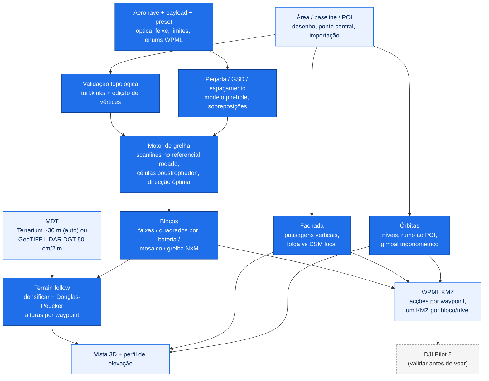

# dji-mission-planner

**[English](README.md)** | Português

> Planeador de missões de mapeamento por drone, no browser: áreas de levantamento, grelhas fotogramétricas/LiDAR com seguimento do terreno, fachadas, órbitas e pontos de inspecção, divisão em blocos à medida da bateria e exportação KML e DJI WPML (KMZ) para o DJI Pilot 2.

[](https://react.dev)
[](https://vitejs.dev)
[](https://leafletjs.com)
[](https://turfjs.org)
[](https://threejs.org)
[](https://enterprise.dji.com)
[](https://developer.dji.com/doc/cloud-api-tutorial/en/api-reference/dji-wpml/overview.html)
[](#utilizacao)
[](#fontes-de-dados)
[](LICENSE)
[](https://github.com/PedroMMGoncalves/dji-mission-planner/releases)
[](https://doi.org/10.5281/zenodo.22238440)
[](https://github.com/PedroMMGoncalves/dji-mission-planner/actions/workflows/deploy.yml)
[](https://pedrommgoncalves.github.io/dji-mission-planner/)
[](https://github.com/PedroMMGoncalves/dji-mission-planner/commits/main)

Aplicação de página única, 100% no cliente (sem backend, sem chaves de API), que planeia missões de ponta a ponta: perfis de aeronave+payload, definição da área, grelha de voo côncava-segura, seguimento do terreno a partir de um MDT, divisão em blocos à medida da bateria, modo fachada, órbitas multi-nível, pontos de inspecção, GCPs, relatório imprimível e checklist de campo. As missões exportam como KML simples ou na estrutura oficial DJI WPML (`wpmz/template.kml` + `waylines.wpml`), prontas a importar no **DJI Pilot 2**.

Esta ferramenta é **apenas o motor de planeamento**. A autorização de espaço aéreo, o licenciamento de zonas UAS e a execução do voo acontecem a montante/jusante e NÃO fazem parte da app. Valide sempre a missão importada no DJI Pilot 2 antes de voar.

**App publicada:** <https://pedrommgoncalves.github.io/dji-mission-planner/>

<!-- As capturas são feitas na passagem de QA de cada versão e repostas aqui.
 -->

## Índice

[Começo rápido](#comeco-rapido) - [Resumo](#resumo) - [Método](#metodo) - [Estado da validação](#estado-da-validacao) - [Requisitos](#requisitos) - [Fontes de dados](#fontes-de-dados) - [Utilização](#utilizacao) - [Exportações](#exportacoes) - [Notas DJI Pilot 2](#notas-dji-pilot-2) - [Desenvolvimento](#desenvolvimento) - [Publicação](#publicacao) - [Limitações e notas](#limitacoes-e-notas) - [Citação](#citacao) - [Licença](#licenca)

---

## Começo rápido

1. **Abra a app** no endereço publicado (ou `npm install && npm run dev` localmente).
2. **Escolha a aeronave e o payload** (M3E, M4T, M300 RTK com P1, YellowScan Mapper+ ou custom) e um **preset de missão** — ou defina altitude/GSD, velocidade e sobreposições à mão.
3. **Escolha o tipo de missão** no selector do topo do painel: **Área** (grelha nadir/oblíqua), **Fachada** (serpentina vertical sobre uma face) ou **Órbita** (círculos multi-nível em torno de um alvo). Os pontos de inspecção vivem como camada extra do modo Área.
4. **Área**: desenhe um polígono, gere um rectângulo/quadrado a partir do ponto central, ou importe KML / GeoJSON / Shapefile zipado / KMZ WPML. A direcção **Óptima** procura a orientação com menos faixas dentro do polígono real.
5. **Divida em blocos** quando a área excede uma bateria: faixas por área, quadrados dimensionados pela bateria (com tecto VLOS) ou mosaico manual com células clicáveis.
6. **Terreno**: o MDT global descarrega automaticamente; active o *terrain follow* para alturas por waypoint, ou importe um GeoTIFF LiDAR da DGT (50 cm / 2 m). Verifique na **vista 3D** e no **perfil de elevação** — a vista 3D também mostra as passagens de fachada e os anéis de órbita.
7. **Exporte**: KML simples ou WPML (KMZ) — um KMZ por bloco (ZIP) com blocos activos, um KMZ por nível nas órbitas. Imprima o **relatório de missão** e leve a **checklist de campo**.

---

## Resumo

- **Modelo aeronave + payload** (`src/data/drones.js`): aeronaves com limites de velocidade, bateria por omissão e enums WPML; payloads com óptica (câmara) ou geometria do feixe (LiDAR), incluindo o YellowScan Mapper+ no M300 (enum PSDK 65534, documentado); bateria por combinação aeronave+payload; migração automática de projectos antigos.
- **Grelha de voo côncava-segura** (`src/utils/geo.js` + `src/utils/gridRoute.js`): decomposição celular boustrophedon ([Choset & Pignon, 1998](#código-de-terceiros)) — em polígonos côncavos as ligações entre faixas nunca atravessam os vãos da área; em áreas convexas a rota é exactamente a serpentina clássica (garantido por teste). Pesquisa de **direcção óptima** (menos faixas no polígono real), **overshoot** por faixa (viragens fora da área), **fiada de amarração** perpendicular para LiDAR e alinhamento global das faixas entre blocos.
- **Honestidade numérica**: GSD oblíquo pelo alcance inclinado ao centro do quadro (a −60° é ~15% pior que o nadir; o espaçamento continua nadir-based por ser conservador); densidade de pontos LiDAR (PRR ÷ velocidade × faixa, com a âncora de 170 pts/m² do Mapper+ verificada); aviso de tecto operacional AGL por payload.
- **Mapeamento de corredor** (`src/utils/corridor.js`): cobre infraestruturas lineares — estradas, condutas, linhas de água, linhas eléctricas — a partir de um eixo desenhado em vez de um polígono. Define-se a meia-largura e o número de passagens sai daí, da altitude e da sobreposição lateral; a contagem cresce uma passagem de cada vez, nunca aos saltos. O desvio paralelo usa **juntas em esquadria**, para um vértice ficar exactamente à distância do desvio dos *dois* segmentos adjacentes (uma normal média encolheria a cobertura para `desvio · cos φ` justamente na curva). Onde a curvatura é mais apertada do que o desvio, a linha desviada dobrar-se-ia sobre si própria e o drone voaria um laço: cada ponto do desvio só é mantido se distar do eixo o próprio desvio, pelo que as dobras desaparecem por construção e a passagem parte-se em troços — o painel diz quantas partiram e porquê. As posições de fotografia são amostradas **pelo comprimento de arco de cada passagem**, não projectadas do eixo, porque numa curva a passagem interior é mais curta do que a exterior e projectar daria sobreposição a mais no interior e a menos na berma exterior, precisamente onde é necessária.
- **Modo fachada** (`src/utils/faceMode.js`): serpentina vertical sobre o pé da face desenhado no mapa — passagens a alturas crescentes, rumo perpendicular ao troço local, uma foto por waypoint; o piso de segurança de 5 m limita todo o intervalo de passagens (com afastamentos curtos a imagem é estreita, pelo que o painel indica a faixa no pé da face que fica sem cobertura); verificação de **folga contra um DSM local** (vertical e ao longo do rumo), com aviso claro de "afastamento não verificado" quando só há tiles globais.
- **Órbitas multi-nível** (`src/utils/orbit.js`): círculos empilhados em torno de um POI, pontos por volta a partir da sobreposição, rumo ao alvo, gimbal por nível apontado à cota do centro, exportação em voo curvo contínuo — missão única ou um KMZ por nível.
- **Pontos de inspecção** (`src/utils/inspect.js`): waypoints avulsos com etiqueta, rumo/pitch/foto por ponto, ordenação por arrasto ou sugestão vizinho-mais-próximo, exportação própria e tabela no relatório.
- **Dupla grelha 3D com passagem nadir opcional**: crosshatch a −60° e, se activada, uma terceira grelha nadir no fim (o gimbal roda a −90° por acções de waypoint) — o GSD apresentado passa ao nadir, a resolução governante do orto.
- **Blocos**: faixas por área máxima; quadrados por bateria resolvidos de um modelo de tempo de voo (duração × reserva − trânsito, tecto VLOS); mosaico manual com células clicáveis e Ctrl+Z; grelhas N×M do ponto central.
- **Seguimento do terreno** (`src/utils/terrain.js`): tiles Terrarium (~30 m) com despiking, ou GeoTIFF LiDAR da DGT lido por janela (`src/utils/demFile.js`, ficheiros multi-GB seguros); densificação + Douglas-Peucker em alturas por waypoint; sugestões para encostas íngremes (linhas ao longo das curvas de nível, gimbal oblíquo).
- **Exportador WPML** (`src/utils/exporters.js`): acções por waypoint (rumo fixo, gimbal, foto), disparo por waypoint nas grelhas de área (passagens densificadas a passos iguais ≤ intervalo, uma acção de foto por ponto, sem gatilho por distância), modo de viragem configurável, sem acções de câmara nos payloads LiDAR, nomes com o tipo de missão codificado (`missao_area-crosshatch-nadir_b01`, `missao_face_p1-6`, `missao_orbit_n3`).
- **GCPs, relatório e checklist**: heurística bordo+centro para GCPs; relatório A4 com mapa; checklist de 75+ itens com grupos condicionais por payload (LiDAR) e por modo (fachada), registos de voo e GCPs, exportação JSON e impressão.
- **Preflight**: verificação única antes de exportar — bloqueios (sem plano, seguir terreno sem relevo ou com foto por waypoint, limite de waypoints do WPML) desactivam o botão do KMZ; avisos (bateria, tecto AGL, obturador, tamanho da rota) e lembretes (alturas relativas à descolagem) listam-se a partir de uma pastilha no cabeçalho.
- **Projectos**: gravação automática no browser + ficheiro JSON; resumo agregado (tempo, baterias, fotos) quando coexistem vários planos. **UI bilingue** (PT/EN).

<!-- As capturas são feitas na passagem de QA de cada versão e repostas aqui.
 -->
<!-- As capturas são feitas na passagem de QA de cada versão e repostas aqui.
 -->

---

## Método



O espaçamento entre faixas vem da pegada transversal no solo, `altitude × largura_do_sensor / focal`, vezes `(1 − sobreposição_lateral)`; o intervalo de disparo usa a pegada longitudinal e a sobreposição frontal (a faixa LiDAR usa `2 × altitude × tan(FOV/2)`). A grelha calcula-se num referencial rodado (área rodada de `90° − azimute` em torno de um pivô partilhado) com scanlines horizontais agrupadas em células contíguas; com blocos, todas as células partilham a mesma origem de alinhamento, mantendo as faixas colineares entre blocos.

---

## Estado da validação

**Exportação verificada contra a especificação WPML e testes automáticos; validação em voo real prevista para setembro de 2026.** Duas suites correm em cada push no CI (`npm test`): a `smoke-test.mjs` cobre a matemática de planeamento e a estrutura dos ficheiros exportados, e a `smoke-test-io.mjs` cobre a fronteira dos ficheiros — os leitores de KML/GeoJSON, WPML e GeoTIFF, incluindo entradas malformadas, com uma ida e volta que exporta uma missão e a volta a importar. Uma terceira camada, `npm run test:e2e`, conduz a build de produção em Chromium headless como um operador faria — importa um polígono e um MDT sintético, liga dupla grelha, terrain follow e blocos por bateria, exporta o KMZ — e mede o ficheiro exportado: folga ao solo ao longo de toda a rota, grupos de disparo, um KMZ por bloco. Ao todo, 640+ asserções; o que elas não cobrem está no protocolo manual [docs/QA_MANUAL.md](docs/QA_MANUAL.md), corrido por release — a passagem da versão corrente está ainda por fazer. Os enums WPML nunca foram testados num comando real — ver as notas abaixo.

**Estado dos perfis:** todos os perfis de câmara (M3E, M4T grande-angular e térmica, P1) e o Mapper+ usam valores publicados nas fichas técnicas. A grande-angular do M4T (1/1.3", 24 mm eq., focal real 6,72 mm, 4032×3024 no modo 12 MP que a aeronave escreve por omissão) e a térmica (VOx 640×512, 12 µm, focal 12 mm, DFOV 45°) estão confirmadas contra o EXIF de fotografias originais da aeronave (firmware 10.00.21.17); o GSD térmico é calculado sobre o detector físico e não sobre o R-JPEG 1280×1024 de super-resolução. Para fotografias de 48 MP use o sensor custom com 8064 px (o GSD passa a metade).

## Requisitos

- Qualquer browser moderno (Chromium, Firefox, Safari). Sem conta, sem chaves de API.
- Para desenvolvimento: Node.js ≥ 18 e npm.
- Internet para mapas base, CAOP e MDT global (um GeoTIFF local serve de fonte de elevação depois de importado).

## Fontes de dados

- **Mapas base:** Esri World Imagery / etiquetas / topográfico, OpenStreetMap.
- **Limites administrativos:** CAOP © Direção-Geral do Território (CC-BY 4.0) — municípios como vectores simplificados, freguesias via WMS da DGT.
- **Elevação global:** tiles Terrarium (Mapzen / AWS Open Data, ~30 m).
- **Elevação de alta resolução:** [Levantamento LiDAR de Portugal continental](https://www.dgterritorio.gov.pt/levantamento-lidar-de-portugal-continental-0) © DGT (CC-BY 4.0) — descarregue o MDT GeoTIFF (50 cm ou 2 m) da sua área no [portal CDD](https://cdd.dgterritorio.gov.pt/) e importe-o; só a janela sobre a área é lida, pelo que ficheiros municipais de vários GB abrem em segundos.

## Utilização

O selector no topo do painel escolhe o tipo de missão (**Área | Fachada | Órbita**) e troca a ferramenta de desenho e os parâmetros; os pontos de inspecção são uma camada extra do modo Área. Dentro de cada modo o painel guia de cima para baixo; o cabeçalho tem a vista 3D, o relatório, a checklist, as exportações do modo Área, a ajuda e a língua. Tudo recalcula reactivamente; o painel de métricas (canto inferior direito) mostra GSD (ou densidade LiDAR), pegada, espaçamento, contagens, distância e tempo estimado, e uma faixa no topo do mapa soma os totais quando há vários planos no projecto.

Gestos de edição: clique acrescenta vértices (Backspace ou clique num vértice remove, duplo clique conclui, Esc cancela); arraste vértices, arraste os pontos médios das arestas para inserir; clique nas células do mosaico para as desactivar; **Ctrl+Z** desfaz edições de área e células; os cartões dos pontos de inspecção arrastam-se na lista.

## Exportações

| Exportação | Conteúdo | Uso |
| --- | --- | --- |
| KML simples | Polígono, base, GCPs, faixas | Desenho no Pilot 2; QGIS |
| WPML (KMZ) — Área | `template.kml` + `waylines.wpml`, alturas por waypoint com terrain follow, disparo por distância/tempo/waypoint, `_area[-variantes]_bNN` | Importação directa no Pilot 2; um KMZ por bloco (ZIP) |
| WPML (KMZ) — Fachada | Rumo fixo e foto por waypoint, `_face_p1-N` | Faces, taludes, estruturas |
| WPML (KMZ) — Órbita | Voo curvo contínuo, rumo ao POI, gimbal por nível, `_orbit_nN` (única ou ZIP por nível) | Inspecção/3D de alvos isolados |
| WPML (KMZ) — Inspecção | Pontos avulsos com rumo/pitch/foto, `_inspect_nN` | Inspecção dirigida |
| KML de GCPs | Pontos numerados | Rover RTK / campo |
| JSON do projecto | Estado completo do planeador; documentado pelo [esquema JSON](public/schema/project-v2.schema.json) publicado (`$schema` no ficheiro) | Arquivo, partilha |
| Checklist JSON / impressão | Registo de campo | Diário de operações |
| Relatório de missão (impressão) | Mapa, parâmetros, blocos, GCPs, pontos de inspecção, assinaturas | Pasta de campo / anexos |

## Notas DJI Pilot 2

Os enums WPML embarcados são `M3E = 77/66`, `M4T = 99/1/89`, `M300 RTK + P1 = 60/50` e `M300 + Mapper+ = 60/65534` (o 65534 é o valor documentado para payloads PSDK de terceiros). Seguem a documentação WPML da DJI mas **nunca foram testados num comando real** — se o Pilot 2 rejeitar uma importação, ajuste em `src/data/drones.js` (ou na UI, no perfil custom) contra a [referência WPML da Cloud API](https://developer.dji.com/doc/cloud-api-tutorial/en/api-reference/dji-wpml/overview.html). As alturas são relativas ao ponto de descolagem: nas missões com terrain follow, marque a base no local real de descolagem antes de exportar; nas fachadas, descole à cota do pé da face.

Os campos de segurança da missão são escritos a partir das enumerações WPML e validados na exportação, pelo que um valor fora do intervalo nunca chega ao ficheiro: `finishAction` (`goHome` / `noAction` / `autoLand` / `gotoFirstWaypoint`), `exitOnRCLost` (`executeLostAction` / `goContinue`) e `executeRCLostAction` (`goBack` / `landing` / `hover`). Por omissão regressam a casa; o exportador aceita valores próprios (`finishAction`, `exitOnRCLost`, `executeRCLostAction`, `rthHeightM`), mas o painel ainda não os expõe. O `globalRTHHeight` assume o maior valor entre 100 m e o tecto da missão mais 20 m, para o regresso não descer para dentro da área — **confirme-o contra o terreno e os obstáculos do local antes de voar.**

Os parâmetros de viragem seguem o modo em vez de serem fixos: as grelhas de área e as fachadas voam troços rectos com paragem em cada waypoint (`useStraightLine` 1), enquanto as órbitas usam curvatura contínua com `useStraightLine` 0, como a especificação exige para uma trajectória curva verdadeira.

## Desenvolvimento

```bash
npm install
npm run dev                # servidor local
npm run lint               # ESLint (inclui as regras react-hooks)
npm run typecheck          # tsc --checkJs sobre os tipos JSDoc de src/utils, src/mission, src/hooks (sem emitir)
npm run test               # as duas suites (correm também no CI antes de cada deploy)
npm run test:unit          # só os testes por propriedades (Vitest + fast-check, tests/unit/)
npm run test:coverage      # suites sob c8 com limiares de cobertura em src/utils/
npm run test:update-golden # regenerar tests/golden/ após alteração intencional
npm run test:e2e           # E2E no browser sobre a build de produção (precisa de npm run build; Chromium via Playwright)
npm run build              # build de produção em dist/
npm run size               # orçamento do pacote (exige build)
```

O [.github/workflows/ci.yml](.github/workflows/ci.yml) corre lint, suite, build de produção, orçamento do pacote e `npm audit` em cada push e em cada pull request; o workflow de publicação repete-os antes de publicar, pelo que o `main` não pode publicar em vermelho. O [codeql.yml](.github/workflows/codeql.yml) corre a análise estática do GitHub no `main`, em pull request e semanalmente, e o Dependabot mantém os pacotes npm e as acções dos workflows actualizados. Todas as acções estão fixadas ao SHA e ambos os workflows declaram `contents: read` — o job de publicação é o único com permissão de escrita.

Os documentos exportados são comparados com ficheiros de referência em `tests/golden/`, pelo que qualquer alteração ao WPML aparece como diferença revisível. Quando é intencional, regenerar com `npm run test:update-golden` e incluir a diferença no commit. A cada release corre-se além disso o protocolo manual de ~12 minutos em [docs/QA_MANUAL.md](docs/QA_MANUAL.md) (interface no browser, incluindo verificação em tablet), registando a passagem na tabela do fim.

## Publicação

Pushes a `main` constroem e publicam automaticamente no GitHub Pages via [.github/workflows/deploy.yml](.github/workflows/deploy.yml). O `base` do Vite aponta ao nome do repositório.

## Limitações e notas

- Alturas em modo `relativeToStartPoint`; a referência é a base marcada (ou o 1.º waypoint). No modo fachada o afastamento só é verificado com um DSM local — os tiles globais não têm resolução à escala de uma face.
- O dimensionamento por bateria usa um modelo de tempo (faixas, ligações, custo de viragem, trânsito) — é uma estimativa; valide contra a autonomia real da aeronave (calibração com logs prevista para setembro de 2026).
- As células do mosaico voam o quadrado inteiro mesmo onde excede o polígono (desactive células a clicar).
- O espaçamento das passagens do corredor fica cerca de 0,6% acima do pedido (constante do referencial planar face aos metros por grau reais), pelo que a sobreposição lateral efectiva fica marginalmente *abaixo* do valor definido — 69,8% para 70% pedidos. Irrelevante em sobreposições normais; a ter em conta ao planear junto a um mínimo.
- O mapeamento de corredor é apenas nadir e ainda não suporta seguimento de terreno nem divisão em blocos por bateria — as passagens voam a uma altitude única relativa ao ponto de descolagem. A faixa desenhada no mapa é ilustrativa: mostra a largura pedida, não a efectivamente coberta, que é menor onde uma passagem teve de ser partida.
- A colocação de GCPs é uma heurística geométrica; não modela a geometria das imagens.
- Sem modo offline, de propósito: o planeamento é trabalho de gabinete.

## Código de terceiros

O motor de planeamento é original deste projecto, com uma excepção, registada
aqui para a proveniência ficar explícita e não enterrada em cabeçalhos.

| Componente | Origem |
| --- | --- |
| `src/utils/gridRoute.js` — decomposição celular boustrophedon | Algoritmo: Choset & Pignon, *Coverage Path Planning: The Boustrophedon Cellular Decomposition*, Field and Service Robotics, 1998. A implementação começou como tradução de `grid_route.py` do [dronnix-io/FlyPath](https://github.com/dronnix-io/FlyPath) (GPL-3.0), modificada para roteamento em graus geográficos; as modificações estão listadas no cabeçalho do ficheiro. |
| `findOptimalDirection` em `src/utils/geo.js` | A estratégia de pesquisa segue a abordagem do `find_optimal_direction` do FlyPath; a implementação é independente (Turf.js num referencial métrico local, em vez de geometria QGIS). |

Todo o resto — modelo de payloads, seguimento de terreno, divisão em blocos,
modo fachada, órbitas, pontos de inspecção, exportador WPML, GCPs, relatório e
checklist — foi escrito para este projecto. Este repositório é GPL-3.0, a mesma
licença do componente reutilizado.

## Citação

Cada release é arquivada no Zenodo com o seu DOI. Para citar uma versão
específica usa-se o DOI dela (v1.0.1: 10.5281/zenodo.22238441); para citar o
software independentemente da versão usa-se o DOI conceptual
**10.5281/zenodo.22238440**, que resolve sempre para a release mais recente. O
repositório inclui um `CITATION.cff` (o GitHub mostra-o em *Cite this
repository*).

> Gonçalves, P. (2026). *dji-mission-planner: browser-based drone mapping
> mission planner for DJI Pilot 2* (v1.1.0) [Software]. Zenodo.
> https://doi.org/10.5281/zenodo.22238440

```bibtex
@software{goncalves_dji_mission_planner,
  author  = {Gon\c{c}alves, Pedro},
  title   = {dji-mission-planner: browser-based drone mapping mission planner for DJI Pilot 2},
  year    = {2026},
  version = {1.1.0},
  doi     = {10.5281/zenodo.22238440},
  url     = {https://doi.org/10.5281/zenodo.22238440}
}
```

## Métodos

[docs/METODOS.md](docs/METODOS.md) é a referência para cada número que a aplicação mostra: as fórmulas tal como estão implementadas (pegada, GSD, espaçamento e intervalo, modelo de tempo e bateria, divisão em blocos, seguimento de terreno com Douglas-Peucker vertical, intervalos de disparo, fachada, órbita, corredor, GCPs, alturas e validação WPML), as constantes e tolerâncias numa só tabela, os datums verticais tal como são tratados, o que não é modelado e a calibração prevista para os voos de Setembro de 2026.

## Protocolo de validação de campo

[docs/VALIDACAO.md](docs/VALIDACAO.md) fixa as missões de referência (`docs/validacao/missoes/`, com a previsão do planeador em `esperado.json`), o procedimento por missão, os critérios de aceitação (`tools/lib/criterios.mjs`), a matriz de compatibilidade Pilot 2 / firmware e o round-trip semântico. `tools/relatorio-validacao.mjs` transforma os resultados planeado‑vs‑medido no relatório de validação e falha quando uma grandeza sai da tolerância; `tools/ensaio-seco.mjs` corre a cadeia inteira com voos sintéticos. Os resultados ficam para os voos de Setembro de 2026.

## Planeado vs medido (validação de campo)

Depois de um voo real, `tools/planeado-vs-medido.mjs` compara o que o planeador previu com o que o voo produziu, a partir do ficheiro de projecto e de qualquer combinação de: fotos (pasta de JPEG lidos por EXIF/XMP, ou CSV do `exiftool -csv -n`), nuvem LiDAR (`.las`, com o CRS do ficheiro) e registo de voo (CSV tipo Airdata). Dá altura AGL, GSD, intervalo entre fotos e sobreposição frontal, espaçamento e sobreposição lateral, contagem de faixas e fotos, fotos dentro da área, duração, densidade de pontos (global e mínima por célula de 10 m) e velocidade, cada uma como planeado / medido / desvio:

```bash
node tools/planeado-vs-medido.mjs --projecto missao-projeto.json --fotos fotos.csv \
  --las nuvem.las --crs EPSG:3763 --log voo.csv --md relatorio.md
```

Corre sobre dados sintéticos na suite de testes; os voos de Setembro de 2026 são a primeira entrada real.

## Contribuir

Ver [CONTRIBUTING.md](CONTRIBUTING.md): ciclo de desenvolvimento, o que cada camada de testes garante, convenções e processo de release. As releases levam um SBOM CycloneDX e uma atestação de proveniência SLSA (`gh attestation verify <ficheiro> --repo PedroMMGoncalves/dji-mission-planner`).

## Licença

[GPL-3.0](LICENSE)
