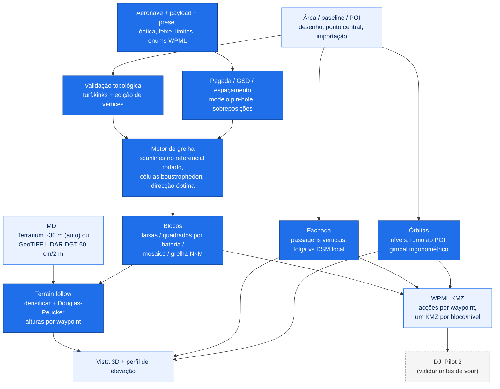

# dji-mission-planner

**[English](README.md)** | Português

> Planeador de missões de mapeamento por drone, no browser: áreas de levantamento, grelhas fotogramétricas/LiDAR com seguimento do terreno, fachadas, órbitas e pontos de inspecção, divisão em blocos à medida da bateria e exportação KML e DJI WPML (KMZ) para o DJI Pilot 2.

[](https://react.dev)
[](https://vitejs.dev)
[](https://leafletjs.com)
[](https://turfjs.org)
[](https://threejs.org)
[](https://enterprise.dji.com)
[](https://developer.dji.com/doc/cloud-api-tutorial/en/api-reference/dji-wpml/overview.html)
[](#utilizacao)
[](#fontes-de-dados)
[](LICENSE)
[](https://github.com/PedroMMGoncalves/dji-mission-planner/actions/workflows/deploy.yml)
[](https://pedrommgoncalves.github.io/dji-mission-planner/)
[](https://github.com/PedroMMGoncalves/dji-mission-planner/commits/main)

Aplicação de página única, 100% no cliente (sem backend, sem chaves de API), que planeia missões de ponta a ponta: perfis de aeronave+payload, definição da área, grelha de voo côncava-segura, seguimento do terreno a partir de um MDT, divisão em blocos à medida da bateria, modo fachada, órbitas multi-nível, pontos de inspecção, GCPs, relatório imprimível e checklist de campo. As missões exportam como KML simples ou na estrutura oficial DJI WPML (`wpmz/template.kml` + `waylines.wpml`), prontas a importar no **DJI Pilot 2**.

Esta ferramenta é **apenas o motor de planeamento**. A autorização de espaço aéreo, o licenciamento de zonas UAS e a execução do voo acontecem a montante/jusante e NÃO fazem parte da app. Valide sempre a missão importada no DJI Pilot 2 antes de voar.

**App publicada:** <https://pedrommgoncalves.github.io/dji-mission-planner/>


## Índice

[Começo rápido](#comeco-rapido) - [Resumo](#resumo) - [Método](#metodo) - [Estado da validação](#estado-da-validacao) - [Requisitos](#requisitos) - [Fontes de dados](#fontes-de-dados) - [Utilização](#utilizacao) - [Exportações](#exportacoes) - [Notas DJI Pilot 2](#notas-dji-pilot-2) - [Desenvolvimento](#desenvolvimento) - [Publicação](#publicacao) - [Limitações e notas](#limitacoes-e-notas) - [Licença](#licenca)

---

## Começo rápido

1. **Abra a app** no endereço publicado (ou `npm install && npm run dev` localmente).
2. **Escolha a aeronave e o payload** (M3E, M4T, M300 RTK com P1, YellowScan Mapper+ ou custom) e um **preset de missão** — ou defina altitude/GSD, velocidade e sobreposições à mão.
3. **Escolha o tipo de missão** no selector do topo do painel: **Área** (grelha nadir/oblíqua), **Fachada** (serpentina vertical sobre uma face) ou **Órbita** (círculos multi-nível em torno de um alvo). Os pontos de inspecção vivem como camada extra do modo Área.
4. **Área**: desenhe um polígono, gere um rectângulo/quadrado a partir do ponto central, ou importe KML / GeoJSON / Shapefile zipado / KMZ WPML. A direcção **Óptima** procura a orientação com menos faixas dentro do polígono real.
5. **Divida em blocos** quando a área excede uma bateria: faixas por área, quadrados dimensionados pela bateria (com tecto VLOS) ou mosaico manual com células clicáveis.
6. **Terreno**: o MDT global descarrega automaticamente; active o *terrain follow* para alturas por waypoint, ou importe um GeoTIFF LiDAR da DGT (50 cm / 2 m). Verifique na **vista 3D** e no **perfil de elevação** — a vista 3D também mostra as passagens de fachada e os anéis de órbita.
7. **Exporte**: KML simples ou WPML (KMZ) — um KMZ por bloco (ZIP) com blocos activos, um KMZ por nível nas órbitas. Imprima o **relatório de missão** e leve a **checklist de campo**.

---

## Resumo

- **Modelo aeronave + payload** (`src/data/drones.js`): aeronaves com limites de velocidade, bateria por omissão e enums WPML; payloads com óptica (câmara) ou geometria do feixe (LiDAR), incluindo o YellowScan Mapper+ no M300 (enum PSDK 65534, documentado); bateria por combinação aeronave+payload; migração automática de projectos antigos.
- **Grelha de voo côncava-segura** (`src/utils/geo.js` + `src/utils/gridRoute.js`): decomposição celular boustrophedon (portada do FlyPath, GPL-3.0) — em polígonos côncavos as ligações entre faixas nunca atravessam os vãos da área; em áreas convexas a rota é exactamente a serpentina clássica (garantido por teste). Pesquisa de **direcção óptima** (menos faixas no polígono real), **overshoot** por faixa (viragens fora da área), **fiada de amarração** perpendicular para LiDAR e alinhamento global das faixas entre blocos.
- **Honestidade numérica**: GSD oblíquo pelo alcance inclinado ao centro do quadro (a −60° é ~15% pior que o nadir; o espaçamento continua nadir-based por ser conservador); densidade de pontos LiDAR (PRR ÷ velocidade × faixa, com a âncora de 170 pts/m² do Mapper+ verificada); aviso de tecto operacional AGL por payload.
- **Modo fachada** (`src/utils/faceMode.js`): serpentina vertical sobre o pé da face desenhado no mapa — passagens a alturas crescentes, rumo perpendicular ao troço local, uma foto por waypoint; verificação de **folga contra um DSM local** (vertical e ao longo do rumo), com aviso claro de "afastamento não verificado" quando só há tiles globais.
- **Órbitas multi-nível** (`src/utils/orbit.js`): círculos empilhados em torno de um POI, pontos por volta a partir da sobreposição, rumo ao alvo, gimbal por nível apontado à cota do centro, exportação em voo curvo contínuo — missão única ou um KMZ por nível.
- **Pontos de inspecção** (`src/utils/inspect.js`): waypoints avulsos com etiqueta, rumo/pitch/foto por ponto, ordenação por arrasto ou sugestão vizinho-mais-próximo, exportação própria e tabela no relatório.
- **Dupla grelha 3D com passagem nadir opcional**: crosshatch a −60° e, se activada, uma terceira grelha nadir no fim (o gimbal roda a −90° por acções de waypoint) — o GSD apresentado passa ao nadir, a resolução governante do orto.
- **Blocos**: faixas por área máxima; quadrados por bateria resolvidos de um modelo de tempo de voo (duração × reserva − trânsito, tecto VLOS); mosaico manual com células clicáveis e Ctrl+Z; grelhas N×M do ponto central.
- **Seguimento do terreno** (`src/utils/terrain.js`): tiles Terrarium (~30 m) com despiking, ou GeoTIFF LiDAR da DGT lido por janela (`src/utils/demFile.js`, ficheiros multi-GB seguros); densificação + Douglas-Peucker em alturas por waypoint; sugestões para encostas íngremes (linhas ao longo das curvas de nível, gimbal oblíquo).
- **Exportador WPML** (`src/utils/exporters.js`): acções por waypoint (rumo fixo, gimbal, foto), modo de viragem configurável, sem acções de câmara nos payloads LiDAR, nomes com o tipo de missão codificado (`missao_area-crosshatch-nadir_b01`, `missao_face_p1-6`, `missao_orbit_n3`).
- **GCPs, relatório e checklist**: heurística bordo+centro para GCPs; relatório A4 com mapa; checklist de 75+ itens com grupos condicionais por payload (LiDAR) e por modo (fachada), registos de voo e GCPs, exportação JSON e impressão.
- **Projectos**: gravação automática no browser + ficheiro JSON; resumo agregado (tempo, baterias, fotos) quando coexistem vários planos. **UI bilingue** (PT/EN).


---

## Método



O espaçamento entre faixas vem da pegada transversal no solo, `altitude × largura_do_sensor / focal`, vezes `(1 − sobreposição_lateral)`; o intervalo de disparo usa a pegada longitudinal e a sobreposição frontal (a faixa LiDAR usa `2 × altitude × tan(FOV/2)`). A grelha calcula-se num referencial rodado (área rodada de `90° − azimute` em torno de um pivô partilhado) com scanlines horizontais agrupadas em células contíguas; com blocos, todas as células partilham a mesma origem de alinhamento, mantendo as faixas colineares entre blocos.

---

## Estado da validação

**Exportação verificada contra a especificação WPML e testes automáticos; validação em voo real prevista para setembro de 2026.** A suite (`smoke-test.mjs`, 300+ asserções) corre em cada push no CI e cobre a matemática de planeamento e a estrutura dos ficheiros exportados; o que ela não cobre está no protocolo manual [docs/QA_MANUAL.md](docs/QA_MANUAL.md), corrido por release. Os enums WPML nunca foram testados num comando real — ver as notas abaixo.

**Estado dos perfis:** as ópticas do **M4T são provisórias** (valores da classe M3E, assinalados no código) até chegarem dados EXIF reais — não confie na pegada/GSD do M4T para dimensionar missões. Os restantes perfis (M3E, P1, Mapper+) usam valores publicados.

## Requisitos

- Qualquer browser moderno (Chromium, Firefox, Safari). Sem conta, sem chaves de API.
- Para desenvolvimento: Node.js ≥ 18 e npm.
- Internet para mapas base, CAOP e MDT global (um GeoTIFF local serve de fonte de elevação depois de importado).

## Fontes de dados

- **Mapas base:** Esri World Imagery / etiquetas / topográfico, OpenStreetMap.
- **Limites administrativos:** CAOP © Direção-Geral do Território (CC-BY 4.0) — municípios como vectores simplificados, freguesias via WMS da DGT.
- **Elevação global:** tiles Terrarium (Mapzen / AWS Open Data, ~30 m).
- **Elevação de alta resolução:** [Levantamento LiDAR de Portugal continental](https://www.dgterritorio.gov.pt/levantamento-lidar-de-portugal-continental-0) © DGT (CC-BY 4.0) — descarregue o MDT GeoTIFF (50 cm ou 2 m) da sua área no [portal CDD](https://cdd.dgterritorio.gov.pt/) e importe-o; só a janela sobre a área é lida, pelo que ficheiros municipais de vários GB abrem em segundos.

## Utilização

O selector no topo do painel escolhe o tipo de missão (**Área | Fachada | Órbita**) e troca a ferramenta de desenho e os parâmetros; os pontos de inspecção são uma camada extra do modo Área. Dentro de cada modo o painel guia de cima para baixo; o cabeçalho tem a vista 3D, o relatório, a checklist, as exportações do modo Área, a ajuda e a língua. Tudo recalcula reactivamente; o painel de métricas (canto inferior direito) mostra GSD (ou densidade LiDAR), pegada, espaçamento, contagens, distância e tempo estimado, e uma faixa no topo do mapa soma os totais quando há vários planos no projecto.

Gestos de edição: clique acrescenta vértices (Backspace ou clique num vértice remove, duplo clique conclui, Esc cancela); arraste vértices, arraste os pontos médios das arestas para inserir; clique nas células do mosaico para as desactivar; **Ctrl+Z** desfaz edições de área e células; os cartões dos pontos de inspecção arrastam-se na lista.

## Exportações

| Exportação | Conteúdo | Uso |
| --- | --- | --- |
| KML simples | Polígono, base, GCPs, faixas | Desenho no Pilot 2; QGIS |
| WPML (KMZ) — Área | `template.kml` + `waylines.wpml`, alturas por waypoint com terrain follow, disparo por distância/tempo, `_area[-variantes]_bNN` | Importação directa no Pilot 2; um KMZ por bloco (ZIP) |
| WPML (KMZ) — Fachada | Rumo fixo e foto por waypoint, `_face_p1-N` | Faces, taludes, estruturas |
| WPML (KMZ) — Órbita | Voo curvo contínuo, rumo ao POI, gimbal por nível, `_orbit_nN` (única ou ZIP por nível) | Inspecção/3D de alvos isolados |
| WPML (KMZ) — Inspecção | Pontos avulsos com rumo/pitch/foto, `_inspect_nN` | Inspecção dirigida |
| KML de GCPs | Pontos numerados | Rover RTK / campo |
| JSON do projecto | Estado completo do planeador | Arquivo, partilha |
| Checklist JSON / impressão | Registo de campo | Diário de operações |
| Relatório de missão (impressão) | Mapa, parâmetros, blocos, GCPs, pontos de inspecção, assinaturas | Pasta de campo / anexos |

## Notas DJI Pilot 2

Os enums WPML embarcados são `M3E = 77/66`, `M4T = 99/1/89`, `M300 RTK + P1 = 60/50` e `M300 + Mapper+ = 60/65534` (o 65534 é o valor documentado para payloads PSDK de terceiros). Seguem a documentação WPML da DJI mas **nunca foram testados num comando real** — se o Pilot 2 rejeitar uma importação, ajuste em `src/data/drones.js` (ou na UI, no perfil custom) contra a [referência WPML da Cloud API](https://developer.dji.com/doc/cloud-api-tutorial/en/api-reference/dji-wpml/overview.html). As alturas são relativas ao ponto de descolagem: nas missões com terrain follow, marque a base no local real de descolagem antes de exportar; nas fachadas, descole à cota do pé da face.

## Desenvolvimento

```bash
npm install
npm run dev          # servidor local
npm run build        # build de produção em dist/
node smoke-test.mjs  # suite de testes (corre também no CI antes de cada deploy)
```

O CI só publica com a suite verde. A cada release corre-se além disso o protocolo manual de ~10 minutos em [docs/QA_MANUAL.md](docs/QA_MANUAL.md) (interface no browser, incluindo verificação em tablet), registando a passagem na tabela do fim.

## Publicação

Pushes a `main` constroem e publicam automaticamente no GitHub Pages via [.github/workflows/deploy.yml](.github/workflows/deploy.yml). O `base` do Vite aponta ao nome do repositório.

## Limitações e notas

- Alturas em modo `relativeToStartPoint`; a referência é a base marcada (ou o 1.º waypoint). No modo fachada o afastamento só é verificado com um DSM local — os tiles globais não têm resolução à escala de uma face.
- O dimensionamento por bateria usa um modelo de tempo (faixas, ligações, custo de viragem, trânsito) — é uma estimativa; valide contra a autonomia real da aeronave (calibração com logs prevista para setembro de 2026).
- As células do mosaico voam o quadrado inteiro mesmo onde excede o polígono (desactive células a clicar).
- A colocação de GCPs é uma heurística geométrica; não modela a geometria das imagens.
- Sem modo offline, de propósito: o planeamento é trabalho de gabinete.

## Licença

[GPL-3.0](LICENSE)
